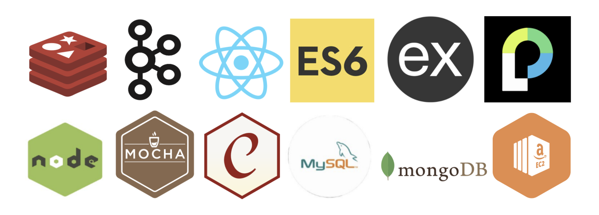

# Food Delivery App

> Individual Project for Gradaute Software Engineering course Enterprise Distributed Systems.

- This project is a clone of Food Delivery app GRUBHUB.
- Users can order their food online as well as Restaurant Owners can manage their menus and pricing.
- Built using React and Node.
- Used MongoDB for storing user and restaurant data.
- Redis for caching frequently accessed restaurant menus.
- Apache Kafka as Message Queues.

## Goal

* The goal is to build a distributed enterprise web application which allows the user to order their food online.
There are 2 actors in the system:

1. Restaurant Owner - Can add new restaurant, menu items, change status of orders.
2. Customers - Can search of different restaurants, dishes, place their order and view order status.

* We were tasked with this project requirement so that we can learn to build enterprise MERN stack applications using various distributed technologies such as Apache Kafka as message queues, Redis for caching, etc.

## System Design

### Technology stack

 
<table>
<thead>
<tr>
<th>Area</th>
<th>Technology</th>
</tr>
</thead>
<tbody>
	<tr>
		<td>Front-End</td>
		<td>React, React Router, Bootstrap, HTML5, CSS3, Javascript ( ES6 )</td>
	</tr>
	<tr>
		<td>Message Queue (Middleware)</td>
		<td>Apache Kafka</td>
	</tr>
	<tr>
		<td>Authentication Middleware</td>
		<td>Passport.js</td>
	</tr>
	<tr>
		<td>Back-End</td>
		<td>Express, Node.js</td>
	</tr>
	<tr>
		<td>In-Memory Caching / Datastore</td>
		<td>Redis</td>
	</tr>
	<tr>
		<td>API Testing</td>
		<td>Mocha, Chai, Postman</td>
	</tr>
	<tr>
		<td>Performance Testing</td>
		<td>JMeter</td>
	</tr>
	<tr>
		<td>Database</td>
		<td>MySQL (Amazon RDS), MongoDB (Mongo Atlas on AWS)</td>
	</tr>
    <tr>
		<td>Deployment</td>
		<td>Amazon Web Services</td>
	</tr>
</tbody>
</table>
 

### Database
> Used MongoDB to store entities with large amount of data and which doesn't need transactional support such as Restaurant details, menu items, etc. and MySQL to store critacl data such as user info, order details, etc.

> Used database pl stored procedure for our booking and payment functionality so that we can provide transaction support and if anything goes wrong in between then we can roll back to a point where the database is in a consistent state.